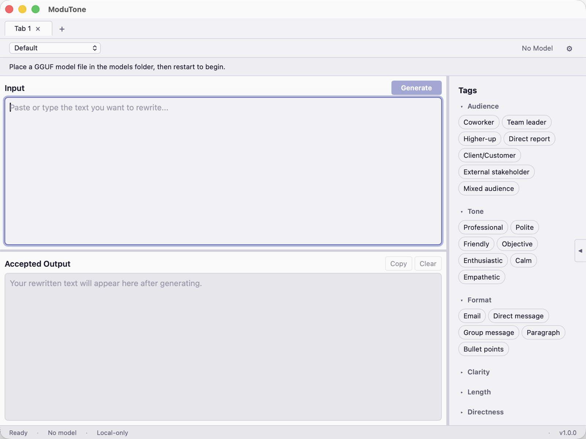
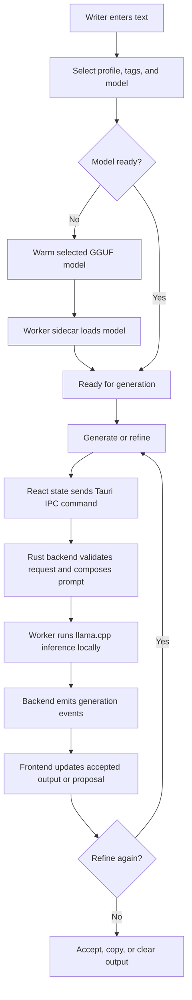

# ModuTone



ModuTone is a privacy-first desktop writing refinement app. It runs local
language models on your machine and does not send writing content to cloud
services, telemetry, or remote APIs.

Built with [Tauri 2](https://tauri.app/), React, TypeScript, Rust, and
[llama.cpp](https://github.com/ggerganov/llama.cpp).

## What It Does

ModuTone helps you improve writing with local AI models. You provide text,
select style tags and a profile, and review generated output before accepting
it.

- **Generate:** Transform input text with the selected model, tags, and
  profile.
- **Refine:** Improve accepted output with natural-language instructions.
- **Compare:** Review proposed output before accepting or rejecting it.

## Key Design Principles

- **Privacy by default:** No writing content is persisted to disk, logged, or
  transmitted.
- **Local inference:** Generation runs on-device with GGUF model files.
- **Non-destructive editing:** Proposed output stays separate until accepted.
- **Composable style controls:** Tags and profiles express writing intent.

## Platform Status

| Platform | Status | Artifact |
| --- | --- | --- |
| Windows 11 x64 | Primary verified target | NSIS plus SFX payload |
| macOS | Build and test path configured | DMG |
| Linux | Build and test path configured | AppImage and deb |

The CI build matrix covers Ubuntu, Windows, and macOS. Windows remains the
primary release target until macOS and Linux packages receive release-device
verification.

## Architecture

ModuTone uses a three-process architecture:

| Process | Technology | Role |
| --- | --- | --- |
| Frontend | React, TypeScript, Zustand | UI and state |
| Backend | Rust, Tauri 2 | IPC, persistence, supervision |
| Worker | Rust, llama.cpp | Model loading and inference |

The frontend talks to the backend through typed Tauri IPC commands. The backend
manages the worker sidecar over a stdin/stdout JSON Lines protocol.

## Workflow



See [Architecture](docs/ARCHITECTURE.md) for the full technical breakdown.

## Installation

Windows release packages use a two-file installer payload:

1. Download `ModuTone_1.0.0_x64-setup.exe`.
2. Download `ModuTone_1.0.0_x64-setup.7z`.
3. Place both files in the same folder.
4. Run `ModuTone_1.0.0_x64-setup.exe`.

The launcher extracts the payload, runs the NSIS installer, and copies bundled
models into the application install directory.

macOS and Linux packages can be built from source. See
[Installation](docs/INSTALLATION.md) for platform details.

## System Requirements

| Requirement | Minimum |
| --- | --- |
| OS | Windows 11 x64, macOS, or Linux |
| RAM | 8 GB for 3B model, 24 GB for 14B model |
| Disk | About 6 GB for app plus bundled models |

ModuTone detects available RAM and labels models as recommended, caution, or
unsupported for the current system.

## Building from Source

Prerequisites:

- Node.js 20 or newer
- Rust stable
- Platform dependencies required by Tauri

```bash
npm ci
npm run build:sidecar
npm run build
```

Model files are required for inference and release packaging. See
[Build from Source](docs/BUILD_FROM_SOURCE.md) for model setup and packaging
commands.

## Testing

Current local validation covers 413 test cases:

```bash
# Frontend, contract, and TypeScript tests: 239 tests
npm run test

# Rust backend and worker tests: 173 tests
npm run test:rust

# Playwright smoke test: 1 test
npm run test:e2e
```

See [Validation Report](docs/VALIDATION_REPORT.md) for the full command list.

## Project Structure

```text
src/                  React frontend
src-tauri/            Rust backend and Tauri app
src-worker/           Inference worker sidecar
tests/                E2E and contract tests
scripts/              Build and packaging scripts
tools/sfx-stub/       Self-extracting installer launcher
docs/                 Project documentation
```

## Documentation

| Document | Description |
| --- | --- |
| [Architecture](docs/ARCHITECTURE.md) | Process model and IPC flow |
| [Privacy](docs/PRIVACY.md) | Content lifecycle and local-only guarantees |
| [Installation](docs/INSTALLATION.md) | Release installation steps |
| [Build from Source](docs/BUILD_FROM_SOURCE.md) | Build and packaging workflow |
| [Windows Release](docs/WINDOWS_RELEASE.md) | Windows installer details |
| [Validation Report](docs/VALIDATION_REPORT.md) | Test and CI coverage |
| [Model Licenses](docs/MODEL_LICENSES.md) | Code, dependency, and model licenses |
| [Roadmap](docs/ROADMAP.md) | Possible future work |

## Technology Stack

- **Frontend:** React 18, TypeScript 5.6, Zustand 5, Vite 6
- **Backend:** Rust, Tauri 2, Tokio, Serde, log4rs
- **Inference:** llama-cpp-2 bindings for llama.cpp
- **Models:** Qwen 2.5 GGUF files
- **Testing:** Vitest 3, Playwright, Cargo test
- **CI:** GitHub Actions on Ubuntu, Windows, and macOS

## License

The application source is available under the
[PolyForm Noncommercial License 1.0.0](LICENSE). You may view, use, modify, and
share the source code for noncommercial purposes. Commercial use requires
separate permission from the author.

Model weights are licensed separately by their upstream authors. See
[Model Licenses](docs/MODEL_LICENSES.md).
